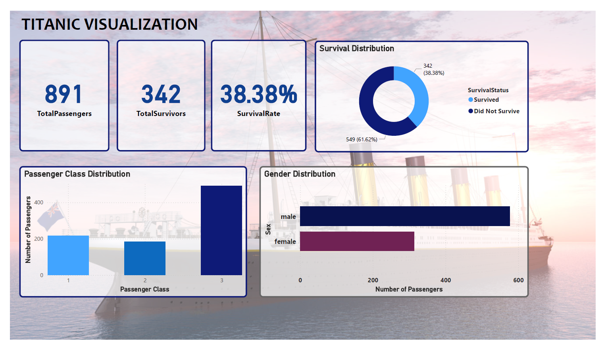
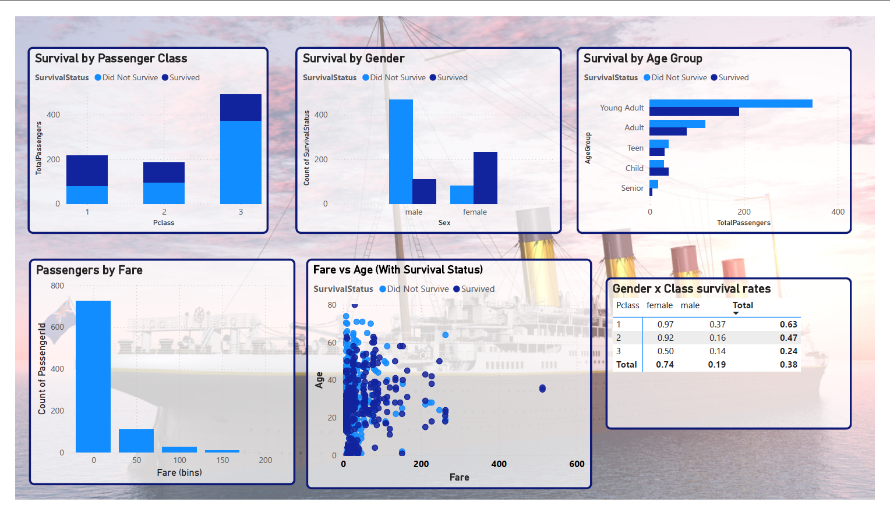
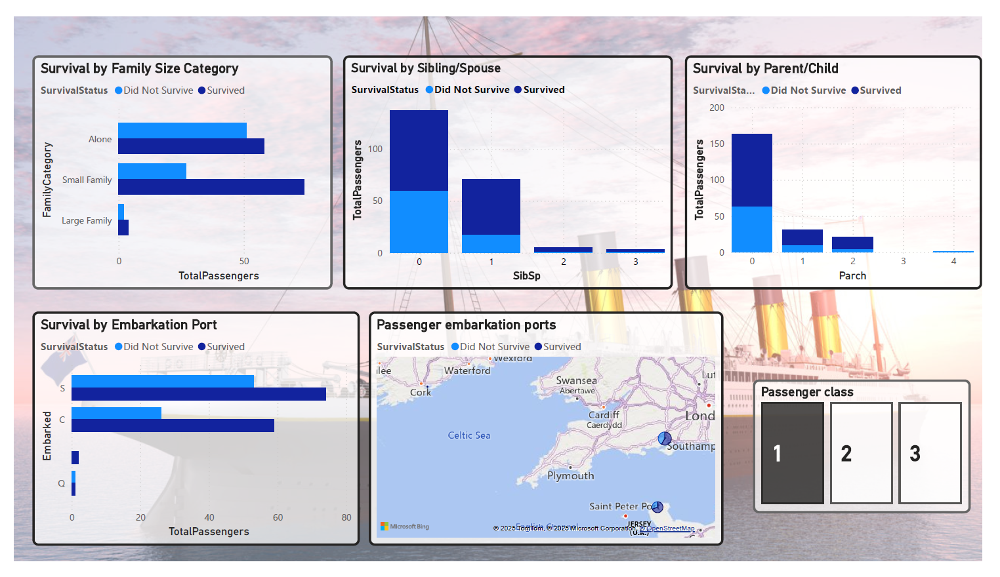

## Titanic Project Visualization

### Table of Contents
1. [Project Overview](#-project-overview)  
2. [Data Sources](#-data-sources)  
3. [Data Analysis Steps](#-data-analysis-steps)  
4. [Insights](#-insights)  
5. [Conclusion](#-conclusion)  

---

###  Project Overview
This project explores the famous Titanic dataset using **Power BI** to perform **exploratory data analysis (EDA)** and build an **interactive dashboard**.  
The goal is to uncover survival patterns based on passenger demographics, class, family size, and embarkation port.

---

###  Data Sources
- **Dataset:** [Titanic dataset.csv]  

---

### Data Analysis Steps
1. **Data Cleaning**
   - Handled missing values in `Age` and `Cabin`.  
   - Created calculated columns:
     - `FamilySize`
     - `FamilyCategory` (Alone, Small, Large)  
     - `AgeGroup` (Child, Teen, Young Adult, Adult, Senior)  
     - `SurvivalStatus` (Survived / Did Not Survive)  

2. **Exploratory Data Analysis (EDA)**
   - Distribution of passengers by class, gender, age, family size, and embarkation.  
   - Survival analysis by class, gender, age group, family size, and embarkation.  
   - Cross-analysis: gender within class, age within class, survival by port.  
   - Outlier check for `Fare` and `Age`.  

3. **Dashboard Development**
   - **Overview Page** → Key metrics (total passengers, survivors, survival rate).  
   - **Survival Drivers Page** → Factors affecting survival (class, gender, age, fare).  
   - **Family & Embarkation Page** → Family size and embarkation port impact.  

---

###  Insights

- **Overall survival rate**: ~38% of passengers survived.  
- **Gender**: Women had a much higher survival rate than men.  
- **Class**: 1st class passengers had the highest survival rate, 3rd class the lowest.  
- **Age**: Children under 12 were more likely to survive compared to adults.  
- **Fare**: Higher ticket fares correlated with better survival chances.  
- **Family size**: Small families had higher survival rates than passengers alone or in very large families.  
- **Embarkation port**: Passengers from Cherbourg had a slightly higher survival rate compared to Southampton and Queenstown.  

---

### Conclusion
The analysis highlights that **survival on the Titanic was strongly influenced by social and demographic factors**.  
Women, children, and passengers from higher classes had significantly better chances of survival.  

This project demonstrates how **Power BI visualizations** can uncover meaningful patterns in historical datasets and provides an interactive way to explore survival outcomes.  
